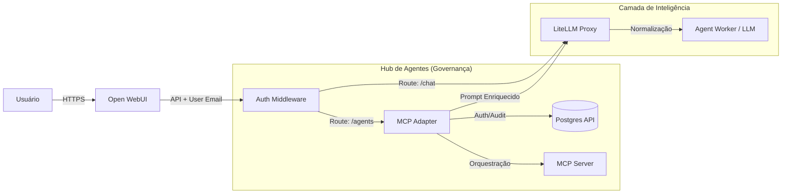
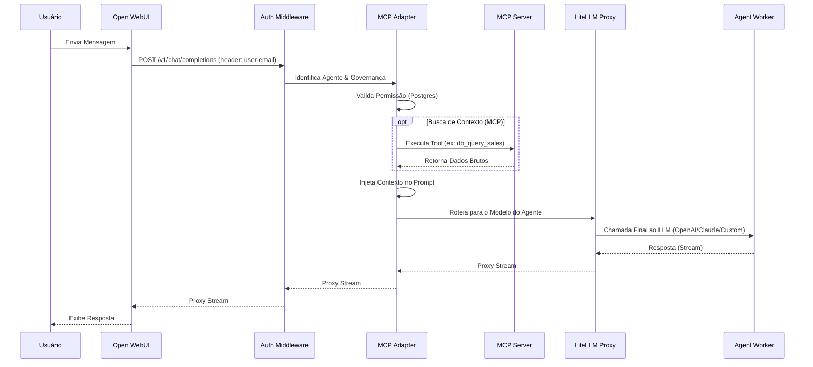

# Arquitetura de Agents Customizados

Este documento descreve o fluxo de comunicação, as responsabilidades de cada componente e o passo a passo para disponibilizar novos agents para grupos específicos.

## 📊 Arquitetura do Sistema



## 🔄 Diagrama de Sequência (Golden Path)



---

## 🏗️ Responsabilidades dos Serviços

### 1. **Open WebUI (Porta 8888)**
- **Interface**: Exibe a lista de agents e o chat especializado.
- **Identificação**: Envia o header `X-OpenWebUI-User-Email`.

### 2. **Auth Middleware (Porta 8000)**
- **Roteador**: Decide se uma mensagem vai para um modelo comum ou para o hub de Agents.

### 3. **MCP Adapter (Porta 8001)**
- **Governança & Auditoria**: Centraliza o controle de quem pode acessar qual agent e registra todo o histórico para conformidade.
- **Orquestração & Enriquecimento**: Identifica a necessidade de dados, consulta os servidores MCP e injeta o contexto no prompt do usuário antes de enviar para o LLM.
- **Discovery**: Serve como catálogo de agents disponíveis para a interface.
- **Transparência**: Atua como um proxy inteligente, permitindo que a inteligência real resida em qualquer lugar (n8n, LangGraph, LLM puro).

### 4. **LiteLLM Proxy (Porta 4000)**
- **Model Gateway**: Centraliza as chaves (OpenAI, Anthropic) e gerencia as conexões tanto para modelos puros quanto para os Worker Agents customizados.
- **Normalização**: Garante que qualquer agent (n8n, Python, etc.) responda no padrão universal da OpenAI.

### 5. **Agent Worker (Externo)**
- **Inteligência**: Onde reside a lógica real do seu agent (pode ser um fluxo no n8n, um grafo no LangGraph ou um script Python).

### 6. **MCP Server (Porta 8080)**
- **Data Provider**: Fornece os dados reais ou simulados (Analytics, DB, CRM) seguindo o protocolo MCP (Model Context Protocol).

---

## 🚀 Como Criar e Disponibilizar um Novo Agent

Para criar um novo agent (ex: `agent-financeiro`) e liberar apenas para o grupo `financeiro`, siga estes passos:

### 1. Criar o Grupo e Associar Usuários
No banco de dados Postgres:
```sql
INSERT INTO groups (name, description) VALUES ('financeiro', 'Grupo com acesso a dados contábeis');
INSERT INTO user_groups (user_id, group_id) SELECT u.id, g.id FROM users u, groups g WHERE u.email = 'diretor@empresa.com' AND g.name = 'financeiro';
```

### 2. Criar o Agent
Defina a personalidade e o modelo que ele usará:
```sql
INSERT INTO agents (agent_key, name, description, llm_provider, llm_model, system_prompt) 
VALUES (
    'agent-financeiro', 
    'Consultor Financeiro', 
    'Especialista em fluxo de caixa e impostos.', 
    'anthropic', 
    'claude-3-haiku', 
    'Você é um consultor financeiro sênior...'
);
```

### 3. Configurar Permissões
Libere o agent apenas para o grupo correto:
```sql
INSERT INTO group_agent_permissions (group_id, agent_id, can_access)
SELECT g.id, a.id, true FROM groups g, agents a 
WHERE g.name = 'financeiro' AND a.agent_key = 'agent-financeiro';
```

### 4. (Opcional) Vincular Fontes de Dados (MCP)
Se o agent precisar consultar o saldo bancário (via MCP):
```sql
INSERT INTO agent_mcps (agent_id, mcp_id)
SELECT a.id, m.id FROM agents a, mcp_configs m 
WHERE a.agent_key = 'agent-financeiro' AND m.name = 'internal-db';
```

### 5. Verificar no Open WebUI
Ao logar com `diretor@empresa.com`, o novo agent aparecerá automaticamente na aba **Agents**. Para outros usuários, ele ficará oculto.
