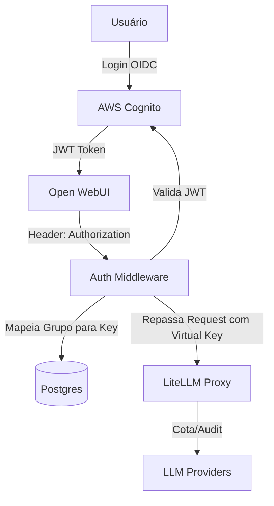

# Guia de Integração: AWS Cognito + Open WebUI + LiteLLM

Este documento descreve como configurar a autenticação centralizada usando **AWS Cognito** e como gerenciar o controle de acesso e cotas distribuídas no **LiteLLM Proxy**.

## 🏗️ Arquitetura de Autenticação



---

## 🔐 1. Configuração no AWS Cognito

1. **User Pool**: Crie um User Pool (ex: `empresa-ai-users`).
2. **App Client**:
   - Ative **OAuth 2.0**.
   - **Allowed Callback URLs**: `http://localhost:8888/oauth/callback`.
   - **Scopes**: `openid`, `email`, `profile`.
3. **Groups**: Crie grupos refletindo os departamentos (ex: `vendas`, `engenharia`, `diretoria`).

---

## 🌐 2. Configuração no Open WebUI

No `docker-compose.yml` ou environment do Open WebUI, ative o OIDC:

```env
ENABLE_OAUTH_SIGNUP=true
OAUTH_CLIENT_ID=seu_client_id_cognito
OAUTH_CLIENT_SECRET=seu_client_secret_cognito
OPENID_CONNECT_URL=https://cognito-idp.{region}.amazonaws.com/{userPoolId}/.well-known/openid-configuration
OAUTH_SCOPES=openid email profile
```

---

## 🛡️ 3. Auth Middleware: O Elo de Ligação

O `auth-middleware` (nosso serviço customizado) desempenha o papel vital de traduzir a identidade do Cognito em permissões do LiteLLM.

### Fluxo de Mapeamento:
1. O Middleware recebe o token JWT.
2. Extrai a claim `cognito:groups`.
3. Consulta no banco de dados local qual **Virtual Key** do LiteLLM pertence àquele grupo.
4. Injeta o header `Authorization: Bearer sk-virtual-key-...` antes de enviar para o LiteLLM.

### Tabela de Mapeamento (`litellm` database):
| Grupo Cognito | Virtual Key (LiteLLM) | Descrição |
| :--- | :--- | :--- |
| `vendas` | `sk-vendas-123` | Cota de $50/mês, Modelos: Claude 3 Haiku |
| `diretoria` | `sk-exec-999` | Sem limite de cota, Modelos: GPT-4, Claude 3.5 Sonnet |

---

## 📈 4. LiteLLM: Acesso Distribuído e Cotas

O LiteLLM Proxy centraliza a governança financeira e técnica.

### Vantagens das Virtual Keys por Grupo:
- **Cotas Financeiras**: Defina um `max_budget` por departamento.
- **Rate Limiting**: Limite o número de requisições por segundo (TPM/RPM) para evitar que um grupo derrube a verba do outro.
- **Model Whitelisting**: O time de `vendas` só vê modelos baratos; o time de `engenharia` tem acesso a modelos de codificação.

### Exemplo de criação de Key via API (feita pelo Middleware):
```bash
curl -X POST 'http://litellm:4000/key/generate' \
-H 'Authorization: Bearer master_key' \
-D '{
    "models": ["claude-3-haiku"],
    "metadata": {"group": "vendas"},
    "max_budget": 50.0,
    "budget_duration": "30d"
}'
```

---

## 🛠️ Comandos de Verificação

### Verificar se o Token do Cognito é válido:
```bash
# No container auth-middleware
curl -X GET http://localhost:8000/health -H "Authorization: Bearer {JWT_DO_COGNITO}"
```

### Consultar Gastos por Grupo no LiteLLM:
```bash
curl -G 'http://localhost:4000/spend/group' \
-H 'Authorization: Bearer master_key'
```

---

## 📝 Resumo de Benefícios

1. **SSO Real**: O usuário loga uma vez via Cognito e tem acesso a tudo.
2. **Segurança**: As chaves reais (OpenAI/Anthropic) nunca saem do LiteLLM.
3. **Controle**: Se o time de Marketing gastar demais, a cota deles trava automaticamente sem afetar o resto da empresa.
4. **Auditoria**: Cada chamada ao LLM é registrada com o e-mail do usuário vindo do Cognito.
